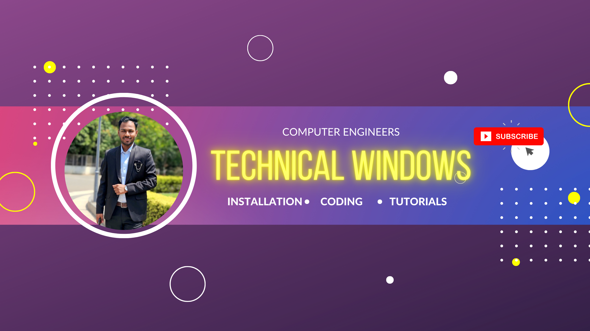

# 🚀 Technical Windows

  

  
  
  

---

## 🌐 Live Website

👉 **Visit Now:**
🔗 https://ganesh-ugale.github.io/technicalwindows/

---

## 👨‍💻 About Me

* 🎓 **SPPU Computer Engineering Graduate**
* 💼 **Software Engineer at Yardi Softwares**
* 📺 Creator of **Technical Windows YouTube Channel**
* 📍 Nashik / Pune, Maharashtra

---

## 📚 What You Will Learn

✔ Hadoop & MapReduce (DSBDA Lab)
✔ Python Programming
✔ Data Science & Big Data Analytics
✔ Apache Spark & Scala
✔ Software Installation (VS Code, MySQL, Anaconda, etc.)
✔ SPPU Practical Tutorials

---

## 🎥 YouTube Channel

## 🎥 YouTube Channel  

  

  

👉 Subscribe: https://www.youtube.com/@technicalwindows47

---

## 🛠 Tech Stack

  

---

## 📊 GitHub Stats

  
   
  

---

## 🔗 Connect With Me

  
  
  

---

## ⚡ Special Note

💡 This website is specially designed for **SPPU Computer Engineering students**
to help them complete **DSBDA practicals easily** with real examples.

---

## 📌 Copyright

© 2025 **Ganesh Ugale | Technical Windows**
All Rights Reserved ❌ (No code reuse allowed)

---
